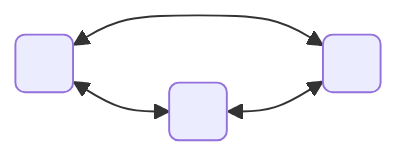

Pertence a: [[Grafos]]
Tags: #p2 #eda2 #conteudo 

---
# Grafos Eulerianos e Hamiltonianos

## Grafo Euleriano

Imagine um rio com duas margens B e C e duas ilhas A e D dentro desse rio. A ilha A está ligada a cada uma das margens por duas pontes. A ilha D está ligada a cada margem por um ponte. Há também uma ponte ligando as ilhas A e D.

Euler observou que toda vez que um caminho chega a um vértice, ele deve sair dele por uma aresta diferente daquele por onde ele chegou (a menos que esse vértice seja o fim do caminho).

Portanto para conseguir passar por todas as sete pontes sem passar mais de uma vez pelo mesmo caminho, os vértices desse grafo devem ser todos de *grau par*, com exceção dos vértices iniciais e finais do caminho.

Um grafo é dito Euleriano se *todos* os seus vértices têm grau par.
Um grafo é dito Semi-Euleriano se *exatamente dois vértices têm grau ímpar* (deve-se começar o caminho em um vértice de ordem impar e terminar no outro de grau impar)

O matemático descobriu o seguinte número $V - A + R$, que hoje é conhecido como _Característica de Euler_. Em que _v_ = o numero de vértices, _A_ o número de arestas e _R_ o número de regiões(o espaço em branco formado pelas arestas(deve se contar o espaço fora do grafo)).

## Grafo Hamiltoniano

Um grafo hamiltoniano é um grafo que contém um _circuito hamiltoniano_.
Um _circuito hamiltoniano_ é um caminho que visita todos os vértices uma única vez e retorna ao vértice inicial

*Teorema de Dirac*
Se G é um grafo simples de ordem n ≥ 3 e g(v) ≥ n/2 para todo v ∈ V(G), então G é hamiltoniano

## Problemas clássicos

Carteiro chinês: visitar todas as arestas uma única vez – Um carteiro tem de fazer a distribuição da correspondência em determinada localidade. Será que consegue fazê-lo e regressar ao posto dos correios, passando uma única vez em cada rua?
->Algoritmo Euleriano 

Carteiro viajante: visitar todos os vértices uma única vez e com o menor custo – Um caixeiro viajante precisa visitar diversas cidades para entregar seus produtos. Será que consegue passar por todas as cidades exatamente uma vez e regressar à cidade de origem realizando o menor percurso possível?
-> Algoritmo Hamiltoniano
