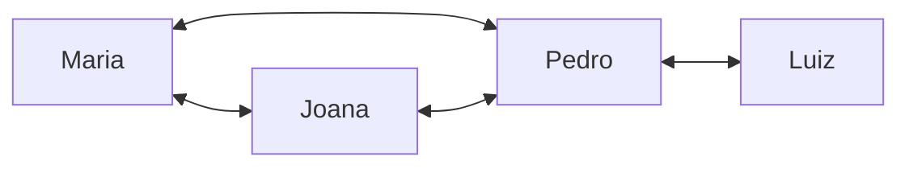
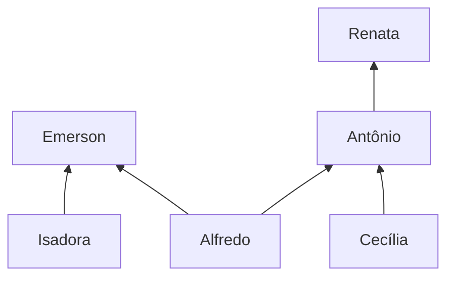
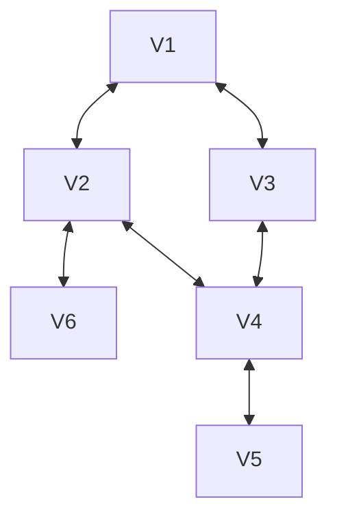
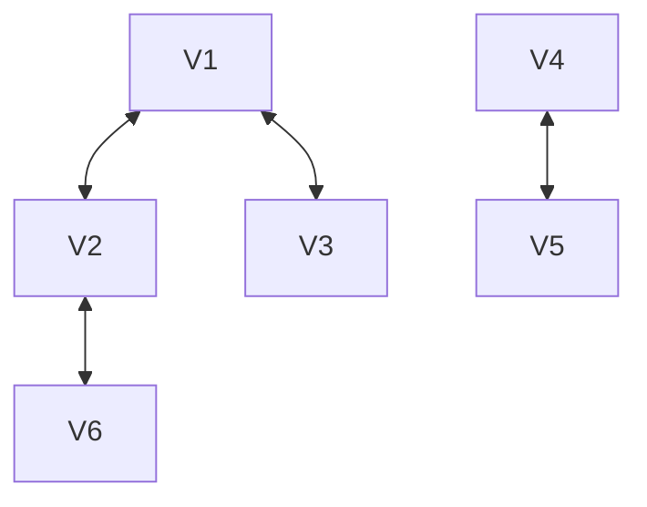
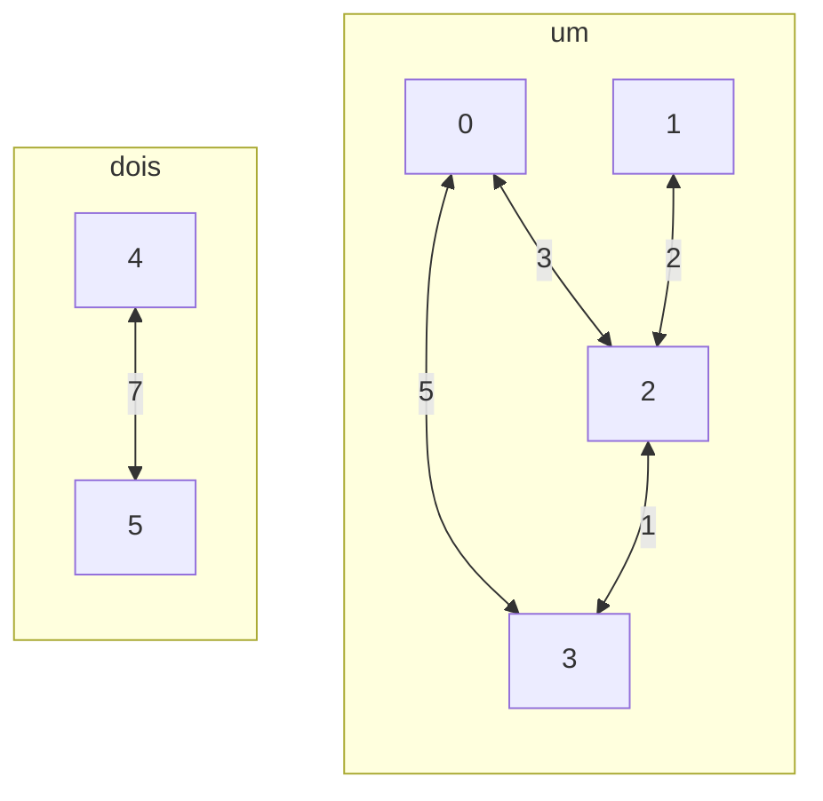
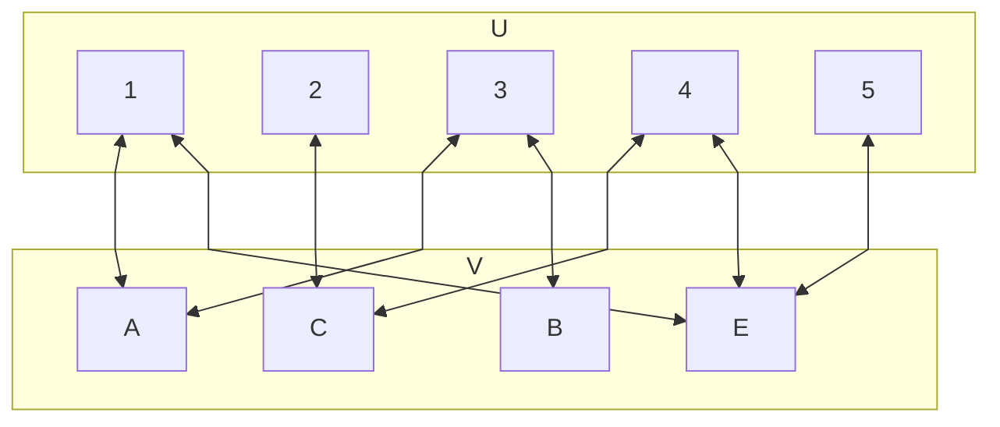
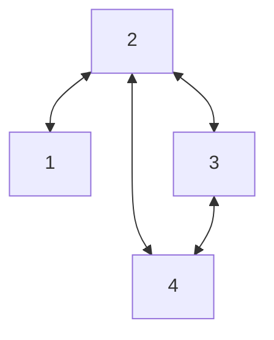
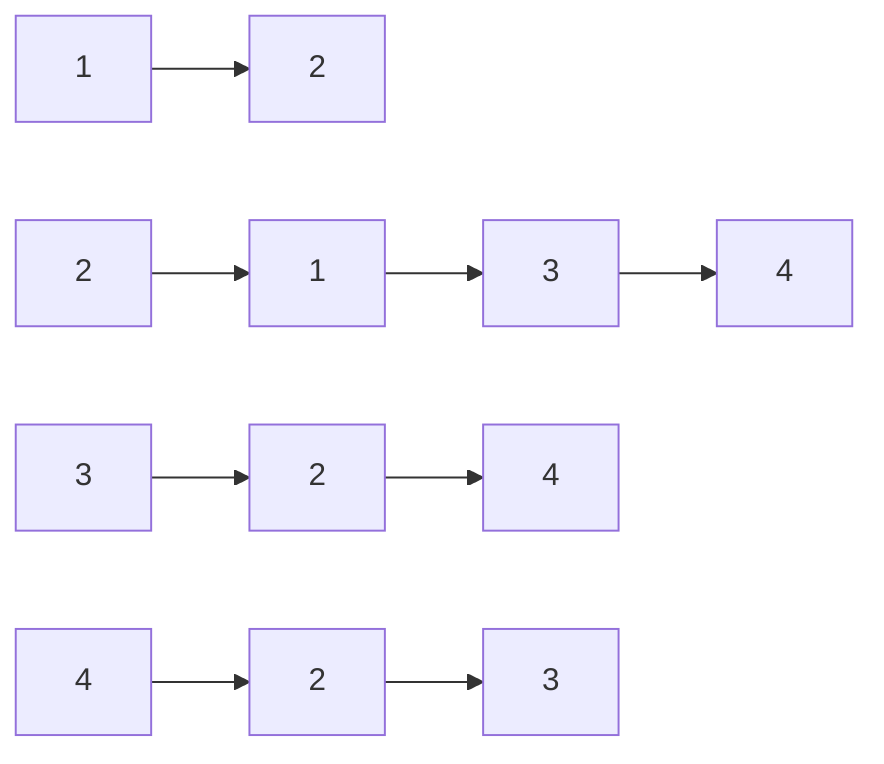

Pertence a: [[EDA2]]
Tags: #eda2 #hub #p2 #conteudo 

---
# Grafos

Um grafo é uma estrutura de dados não linear desenhada para representar _relações_ entre objetos. Enquanto uma árvore (que não deixa de ser um tipo de grafo) tem uma hierarquia restrita de "pai e filho", o grafo é totalmente livre: qualquer elemento pode se conectar a qualquer outro elemento, formando uma verdadeira rede.

Os grafos são formado por *Vértices* e *Arestas*, onde:
- *Vértices*: São entidades fundamentais da estrutura. Podem representar cidades em um mapa, roteadores de uma rede, ou usuários do instagram.
- *Arestas*: São conexões que ligam esses vértices. Representam as estradas, os cabos de rede, ou a relação de "seguir" alguém na rede social.

## Dígrafo

Um dígrafo (abreviação para grafo direcionado) é uma rede onde as relações não são obrigatoriamente recíprocas. A conexão tem uma direção especifica  (unidirecional). A aresta sai de um vértice A e aponta para um vértice B. Para voltar de B para A, precisa existir uma segunda aresta independente no sentido oposto.

## Algumas Definições

### Ordem

A ordem de um grafo *G* é dada pelo numero de vértices de *G*.

Ordem (G1): 4

Ordem (G2): 6

### Adjacência

Em um grafo, dois vértices são adjacentes (ou vizinhos) se há uma aresta a = (v,w) em G.

Exemplo: 
	Maria e Pedro são adjacentes.
	Maria e Luiz não são adjacentes.

No caso de um dígrafo, a adjacência (vizinhança) é especializada em:
- *Sucessor*: um vértice _w_ é sucessor de _v_ se há um arco que parte de _v_ e chega em _w_. No grafo abaixo, diz-se que Emerson e Antônio são sucessores de Alfredo.
- *Antecessor*: um vértice _v_ é antecessor de _w_ se há um arco que parte de _v_ e chega em _w_. No grafo abaixo, diz-se que Alfredo e Cecília são antecessores de Antônio.

### Grau

O grau de um vértice é dado pelo número de arestas que lhe são incidentes.
Por exemplo:
	- Grau(Pedro) = 3
	- Grau(Maria) = 2
	- Grau(Joana) = 2
	- Grau(Luiz) = 1

No caso de um dígrafo, a noção de grau é dividida em:
- *Grau de Emissão (ou saída)*: o grau de emissão de um vértice v corresponde ao número de arcos que partem de v. Por exemplo:
	- grauDeSaida(Antônio) = 1
	- grauDeSaida(Alfredo) = 2
	- grauDeSaida(Renata) = 0

- *Grau de Recepção (ou entrada)*: o grau de recepção de um vértice v corresponde ao número de arcos que chegam a v. Por exemplo:
	- grauDeEntrada(Antônio) = 2
	- grauDeEntrada(Alfredo) = 0
	- grauDeEntrada(Renata) = 1

### Fonte

Um vértice _v_ é uma fonte se grauDeEntrada(v) = 0. É o caso dos vértices Isadora, Alfredo e Cecília.

### Sumidouro

Um vértice _v_ é um sumidouro se o grauDeSaida(v) = 0. É o caso dos vértices Emerson e Renata.

### Laço

Um laço é uma aresta ou arco do tipo a = (v, v), ou seja, que relaciona um vértice a ele próprio.

## Grafos Simples

Um grafo simples é um grafo que satisfaz duas restrições fundamentais:

1) Não possui laços
	Não existe aresta que liga um vértice a ele mesmo. 

2) Não possui arestas múltiplas entre o mesmo par de vértices
	Entre dois vértices só pode existir no máximo duas arestas.

### Propriedades de Grafos Simples

Um grafo simples tem as seguintes propriedades:

1) Se um grafo simples não tem laço, então o grau de cada vértice nesse grafo é menor que $(n-1)$, onde n é a quantidade de arestas.
2) Quantidade máxima de arestas $n(n-1)/2$, pois cada par de vértices só pode ter no máximo uma aresta.

### Caminho em Grafos

- Caminho
	Sequencia de vértices de modo que sempre exista uma aresta ligando o vértice anterior ao seguinte.

- Caminho Simples 
	Nenhum dos vértices do caminho se repetem.

- Comprimento do Caminho
	É o número de arestas que o caminho usa.

- Ciclo
	É um caminho que começa e termina no mesmo vértice.
	Um laço de comprimento 1.

- Grafo Acíclico
	Não contem ciclos.

## Grafo Conexo e Desconexo

### Grafo Conexo

Um Grafo G(V, E) é dito ser conexo se há pelo menos um caminho ligando cada par de vértice deste grafo G.

### Grafo Desconexo

Um grafo G(V, E) é dito ser desconexo se há pelo menos um par de vértices que não está ligado por nenhum caminho.

## Grafos Ponderados

Um grafo ponderado possui pesos associado às arestas.

## Grafos Bipartidos

Um grafo bipartido é um grafo cujos vértices podem ser divididos em dois conjuntos disjuntos _u_ e _v_ de modo que: *Toda aresta liga um vértice de U a um vértice de V.* Ou seja, não existem arestas entre vértices do mesmo conjunto.

## Representação Computacional de Grafos

Podemos representar o grafo de duas maneira: *Matriz de Adjacência* ou *Lista de Adjacência*
Qual usar? Depende
- Grafos esparsos (muitos vértices e poucas arestas) =  Lista
- Grafos muito conectados (muitas arestas) = Matriz

> [!Tip]
> Não é obrigatório usar em nessas ocasiões, mas é recomendado.

### Matriz de Adjacência

Matriz $N x N$, onde N é o número de vértices. Uma aresta será representada pela posição (i,j) dessa matriz.

|       | 1   | 2   | 3   | 4   |
| ----- | --- | --- | --- | --- |
| **1** | 0   | 1   | 0   | 0   |
| **2** | 1   | 0   | 1   | 1   |
| **3** | 0   | 1   | 0   | 1   |
| **4** | 0   | 1   | 1   | 0   |
### Lista de Adjacência

Se eu tiver muitos vértices e poucas conexões? Lista de adjacência!

Lista encadeada:

